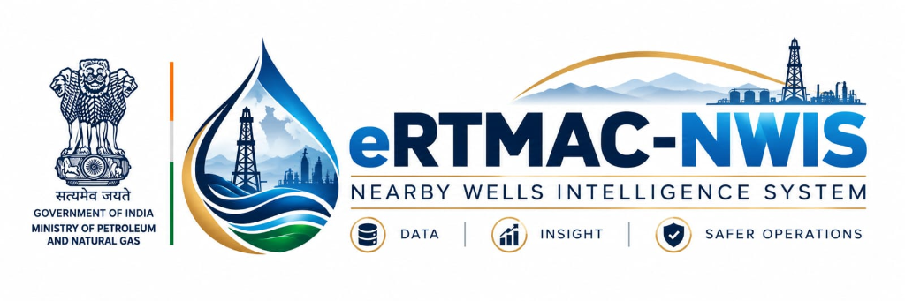

# eRTMAC-NWIS: Nearby Wells Intelligence System

<div align="center">
  
</div>

---

## 1. Project Title
**eRTMAC-NWIS: Nearby Wells Intelligence System** 
*(Real-Time Monitoring & Analytics Center)*

## 2. Problem Statement
**SIH Problem Statement ID:** SIH26121  
**Organization:** Oil India Limited (OIL)  
**Challenge:** Developing an intelligent, real-time spatial decision support system for drilling operations to prevent severe hazards (Stuck Pipe, Gas Kicks, Lost Circulation) by correlating live telemetry with historical offset well intelligence.

## 3. Problem Description
During subsea and onshore drilling, teams often encounter unexpected geological anomalies resulting in catastrophic Non-Productive Time (NPT) and financial losses. Despite having decades of historical records (Well Completion Reports, incident logs, offset wireline logs), drilling engineers lack a unified platform that correlates live surface telemetry (WOB, ROP, Torque) with the spatial intelligence of nearby historical wells in real-time. Without this early warning correlation, reactionary mitigations arrive too late.

## 4. Proposed Solution
eRTMAC-NWIS is a National Decision-Support Platform that ingests 1Hz live drilling telemetry and cross-references it against a geospatial database of offset wells. Powered by Machine Learning Isolation Forests and a multi-agent RAG (Retrieval-Augmented Generation) pipeline, the system detects anomalies (like Torque spikes indicating stuck pipe) up to 15 meters in advance. It automatically retrieves the exact historical mitigation procedures used in nearby wells and presents them in role-specific, actionable dashboards.

## 5. Objectives
*   Provide real-time anomaly detection for drilling physics with leading indicator warnings.
*   Geospatially map and retrieve historical drilling hazards from offset wells.
*   Bridge unstructured historical WCR PDFs with live telemetry using generative AI (RAG).
*   Enforce a strict Role-Based Access Control (RBAC) architecture for authoritative operations.

## 6. Key Features
*   **Live Sensor Streaming:** Real-time ingestion of 1Hz Hookload, SPP, Torque, WOB, and RPM.
*   **Early Warning ML Engine:** Multivariate anomaly detection providing up to 15.0m lead time.
*   **AI Engineering Assistant:** RAG-powered chatbot grounded in historical rig incident PDFs.
*   **Geospatial Alignment:** 2D interactive map ranking the Top 5 similar offset wells.
*   **Automated DDR:** Daily Drilling Report compilation and export workspace.

## 7. Target Users / Stakeholders
*   **Drilling Engineer:** Monitors drilling physics, hydraulics, and ML anomaly scores.
*   **Geologist:** Focuses on stratigraphy, formation tops, and historical offset wireline logs.
*   **eRTMAC Operator:** Observes live 1Hz telemetry streams and initiates rapid hazard interventions.
*   **Management / Supervisor:** Views executive summaries, financial NPT metrics, and field-wide risks.

## 8. System Architecture
The platform is built on a decoupled Client-Server architecture:
*   **Frontend:** React (TypeScript) SPA with Vite, rendering contextual dashboards based on JWT role claims.
*   **Backend:** FastAPI (Python) asynchronous server orchestrating ML anomaly engines, SQLite databases, and Groq LLM pipelines.
*   **Engine:** Internal WITSML simulator mimicking rig-site data flow to the regional command center.

## 9. System Workflow
1.  **Sensor Ingestion:** Simulated Rig site streams 1Hz physics data via REST.
2.  **ML Evaluation:** Data is passed through pre-trained Isolation Forest models.
3.  **Spatial Matching:** Backend calculates distance vectors to 21 historical offset wells.
4.  **Evidence Retrieval:** If an anomaly (e.g., Stuck Pipe) matches historical coordinates, mitigation PDFs are vectorized and queried via Groq AI.
5.  **UI Broadcast:** The alert, historical evidence, and AI mitigation steps are pushed to the user's dashboard.

## 10. Dashboard / Module Details
*   **Operations Command Center:** High-level active well parameters and multi-signal risk alerts.
*   **Live Drilling (eRTMAC):** High-frequency animated telemetry gauges (Hookload, SPP, RPM).
*   **Nearby Wells / GIS:** Interactive map showing offset wells and geological formations.
*   **Risk & Alerts:** Drill-down view into multivariate anomaly scoring and historical precedents.
*   **Historical Wells:** Directory of all regional wells and interactive wellbore telemetry.
*   **AI Assistant:** Natural language interface for querying WCR documents.
*   **Reports Workspace:** DDR generation and export hub.

## 11. Technology Stack
*   **Frontend:** React 18, TypeScript, Tailwind CSS, Lucide Icons, Vite.
*   **Backend:** Python 3.10+, FastAPI, Pandas, Scikit-learn, Numpy.
*   **Database:** SQLite (Relational structure for RBAC, Wells, and Event catalogs).
*   **AI & ML:** Groq API (Qwen/GPT-OSS models), Isolation Forest.
*   **Geospatial:** Leaflet.js, OpenStreetMap.

## 12. Data Sources
*   **Historical Well Logs:** Processed CSV datasets (`drilling_parameters.csv`).
*   **Unstructured Reports:** Verified PDF documents (`data/raw/documents/incident_reports`).
*   **Live Telemetry:** Mocked WITSML physics simulator (`live_service.py`).
*   **Geospatial Base Map:** OpenStreetMap (OSM) Tile API.

## 13. Data Processing / Data Pipeline
Raw CSV logs are normalized, missing values are imputed, and features (Torque, ROP) are scaled. The Isolation Forest algorithm was trained offline on 284,101 depth rows across 21 historical wells to establish baseline operating envelopes for different geological formations (e.g., Barail Shale vs. Kopili).

## 14. AI / RAG Implementation
We utilize the **Groq Inference API** for ultra-low latency response generation. When a hazard is detected, the backend retrieves chunks of historical WCR PDFs related to that specific depth and formation. The LLM (e.g., `qwen3.8-27b`) synthesizes this context to provide the Drilling Engineer with a strict, evidence-based mitigation recommendation. Hallucinations are prevented via strict system prompt grounding.

## 15. Geospatial / Map Integration
Integrated natively using **Leaflet.js** and React hooks (bypassing heavy wrappers). It plots the active rig, renders a dynamic search radius, and plots historical offset wells (color-coded by hazard type). A `ResizeObserver` ensures seamless rendering across varying screen sizes.

## 16. Authentication & Role-Based Access
*   **Authentication:** JWT-based stateless sessions.
*   **RBAC Matrix:** Strict permission enforcement (FULL, USE, VIEW, NONE) at both the React Router layer and the FastAPI dependency injection layer.

## 17. Database Design
Lightweight **SQLite** (`nwis_foundation.db`) schema:
*   `users`: Authentication and Role definition.
*   `wells`: Geospatial coordinates and active status.
*   `events`: Historical hazards, NPT hours, financial loss metrics, and root causes.

## 18. API Architecture
RESTful architecture organized into modular routers:
*   `/api/v1/auth`: Token issuance.
*   `/api/v1/live`: Telemetry streaming.
*   `/api/v1/historical`: Offset well logs and WCR event matching.
*   `/api/v1/assistant`: AI LLM interactions.

## 19. Innovation / Unique Features
*   **15.0m Lead Warning System:** ML anomaly engine detects micro-fluctuations in torque before macro-level pipe sticking occurs.
*   **7-Layer Evidence Framework:** AI doesn't just guess; it links suggestions to exact pages in local WCR PDFs.
*   **No-Reload Entity Switching:** Hot-swap between Drill Engineer and Management views instantly for demo purposes.

## 20. Expected Impact
*   **Safety:** Drastic reduction in sudden gas kick blowouts.
*   **Financial:** Estimated 30% reduction in Non-Productive Time (NPT) costs.
*   **Knowledge Transfer:** Rapid onboarding of junior engineers utilizing decades of institutional memory stored in the AI.

## 21. Feasibility & Scalability
*   **Scalability:** FastAPI async architecture supports thousands of concurrent 1Hz telemetry streams.
*   **Feasibility:** Built strictly using open-source technologies, ensuring zero licensing overhead for deployment on secure internal intranet servers.

## 22. Security & Privacy
*   **Data Isolation:** All ML models and WCR PDFs are processed locally; the LLM only receives heavily redacted contextual chunks.
*   **Role Scoping:** ERTMAC Operators cannot bypass commands restricted to Management.

## 23. Screenshots
*(Add visual placeholders here)*
*   `[Screenshot of Operations Dashboard]`
*   `[Screenshot of Geospatial Nearby Wells Map]`
*   `[Screenshot of AI RAG Chat Interface]`

## 24. Demo / YouTube Video Link
*   **Video Demo:** [Insert YouTube Link Here]

## 25. Live Website / Deployment Link
*   **Deployment:** [Insert Deployment Link Here]

---

## 26. Installation & Setup

**Prerequisites:** Node.js (v18+), Python (3.10+)

**1. Clone the repository**
```bash
git clone <repository-url>
cd WELL_DRILL
```

**2. Setup Backend (FastAPI)**
```bash
cd backend
python -m venv venv
# Windows: venv\Scripts\activate | Mac/Linux: source venv/bin/activate
pip install -r requirements.txt
python main.py
```

**3. Setup Frontend (React/Vite)**
```bash
cd ../frontend
npm install
npm run dev
```
Access the platform at `http://localhost:5173`

---

## 27. Project Folder Structure
```text
WELL_DRILL/
├── backend/                  # FastAPI Server, ML Services, RAG Engine
│   ├── app/
│   │   ├── api/v1/          # REST Endpoints
│   │   ├── services/        # Business Logic & WITSML Sim
│   │   └── core/            # Config & Security
│   └── main.py
├── frontend/                 # React UI
│   ├── src/
│   │   ├── components/      # UI Dashboard Modules
│   │   ├── pages/           # Routed Views
│   │   └── lib/             # API clients, RBAC, Context
│   └── package.json
├── data/                     # CSV logs, Mock Data
└── dataset 1/                # Supplemental ML training data
```

## 28. Future Scope
*   Integration with actual physical rig WITSML XML streams (PROD deployment).
*   3D Subsurface Trajectory visualization using WebGL.
*   On-premise deployment of Llama-3 models to completely remove cloud API dependency.

---

## 29. Team Members & Roles
*   **Maitry Santoshwar** (Team Leader)
*   **Abhay Munjewar** (Member)
*   **Ajay Payer** (Member)
*   **Samiksha Chaudhary** (Member)
*   **Chetna Patil** (Member)

## 30. SIH Problem Statement Details
*   **PS Code:** SIH26121
*   **Theme:** Smart Automation / AI for Oil & Gas
*   **Organization:** Oil India Limited (OIL)

## 31. License
This project is developed for the Smart India Hackathon. All proprietary data rights belong to Oil India Limited. Codebase licensed under MIT (or as applicable per hackathon guidelines).

## 32. Contact Information
*   **Team Leader:** Maitry Santoshwar
*   **GitHub Repository:** [Insert Link]
*   **Email / Contact:** [Insert Contact Details]
